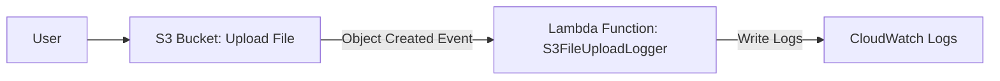

# Week 10: Serverless Event-Driven Architecture 

**🎯 Objective: Build serverless document processing pipeline** 

**🏗️ Architecture:** 

**🔧 Technologies: Lambda, S3 Events, Textract, Comprehend**
 

#### Before writing the Lambda code, we need to ensure SES is ready to send emails and then create/update the Lambda function. 

#### The Lambda Function code 

#### S3 Bucket Event Trigger  -  "Event notifications" 

#### Log entries in CloudWatch Logs that show the S3FileUploadLogger function successfully processing an S3 upload event and attempting to send an email. 

#### Received Email Notification 

### Bonus: AI Enhancement - Keyphrase Extraction using Amazon Comprehend 

_'This week, I’m adding a touch of artificial intelligence to my automated workflow! The goal is simple: when I "submit" my final bootcamp compilation document (e.g., a summary of all 10 weeks) by uploading it to S3, a Lambda function will automatically trigger. This function won't just log the upload; it will use Amazon Comprehend to extract key phrases from the document's content and include them in the email notification. It’s a small step, but it truly showcases the power of combining serverless automation with AI for quick, actionable insights.'_ 

#### Lambda Function Code/Settings with S3 read and Comprehend integration 

**Exciting part: Testing and Verifying AI-Enhanced Workflow** 

_'Crucially, I created a simple .txt file and add some meaningful text to it related to your bootcamp, DevSecOps, AI, AWS services, or your learning journey. This will give Comprehend something to analyze'._ 

_The text in the ‘’aws-cloudsecnetwork-10weeks-tasks-submission.txt’’ file is : 
‘’ This document summarizes my journey through the AWS CloudSec Network bootcamp. I've gained hands-on experience in DevSecOps practices, focusing on cloud security, automated deployments, and intelligent monitoring. Key services mastered include EC2, VPC, ECS Fargate, RDS, S3, CloudFront, Lambda, and CloudWatch. I'm excited about integrating AI/ML services like Amazon Comprehend and Textract for data analysis and automation. This program has significantly boosted my preparation for the AWS Solutions Architect Professional certification.’’_ 

#### We can see The log entries in CloudWatch Logs showing your S3FileUploadLogger function successfully processing an S3 upload, including the "Extracted Key Phrases" output 

#### And here is an email you received in my inbox, demonstrating the automated notification and the extracted key phrases from the document. 

_This week, we set up an S3 upload to trigger a Lambda function that extracts key phrases. Imagine extending this for an automated review! When you submit your comprehensive 10-week compilation file (perhaps a PDF or a structured document with embedded images) to a dedicated S3 bucket, a similar Lambda function could be triggered. This time, however, instead of just extracting text keyphrases, the Lambda could:_ 

 *Deconstruct the Document: If the compilation is a PDF or a complex document, the Lambda could first use Amazon Textract to extract the layout, text, and importantly, identify image regions (your screenshots).* 

 *Analyze Screenshots: For each identified screenshot, the Lambda could then call Amazon Rekognition. Rekognition, an AI service for image and video analysis, could be tasked to:* 

 *Identify specific AWS console elements: Confirm if a screenshot contains, for instance, an "ECS Cluster" page or an "S3 Bucket Policy" editor.* 

 *Detect presence/absence of key indicators: For example, verifying if a "Status: Deployed" or "Status: Issued" is visible on the image, or if specific configurations (like "Public Access: Enabled" for S3 static website hosting) are present in the screenshot.* 

*Automate Feedback: Based on Rekognition's analysis, the Lambda could compare the detected elements against the bootcamp's expected deliverables for that week. If a required element is missing or incorrect in a screenshot, the Lambda could then:* 

*Log detailed feedback to CloudWatch.* 

*Send a personalized email via SES to you, specifying exactly which screenshot (e.g., "Week 8 CloudFront Distribution") is missing a key visual proof or configuration, and what needs to be corrected.* 

*This automated process would act like an "AI teaching assistant," providing instant, intelligent feedback on the visual deliverables, saving manual review time, and ensuring all requirements are met before final submission to the CloudSec Network team. It's a prime example of AI-enhanced DevSecOps in action! 🧠* 
 

#### 📊 Key Learnings: 
    - Event-driven architecture patterns
    - Serverless cost optimization 
    - AI service orchestration
    

