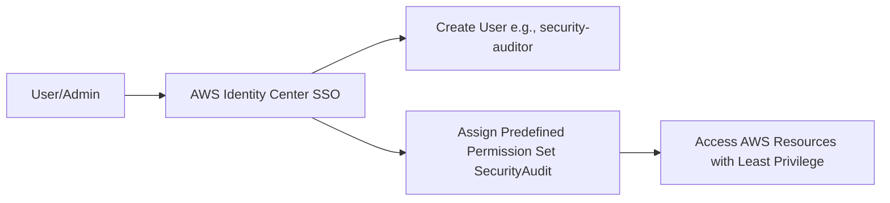

### **Week 2: Identity & Access Management**

**🎯 Objective: Configure centralized identity management with least privilege access** 

### 🏗️ Architecture: 

### 🔧 Technologies: AWS Identity Center, Permission Sets

 

 
### 📊 Key Learnings: 

* Zero-trust security model 

* Federation best practices 

- Least privilege access patterns 

