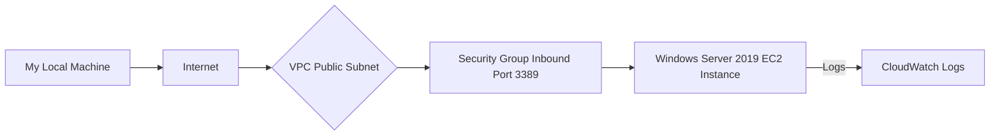

# Week 3: Compute & Security Hardening 

## 🎯 Objective: Deploy secure Windows EC2 instance with proper network isolation 

*🏗️ Architecture*

### 🔧 Technologies: EC2, VPC, Security Groups, Systems Manager 

#### Windows EC2 Instance in the AWS Management Console  - Indicating the instance’s Name tag CSN-Bootcamp-week3 

#### Security Group: inbound rules allowing RDP (port 3389) only from your public IP address 

#### Successful Remote Desktop (RDP) connection to the instance. 

### 📊 Key Learnings: 

* Defense in depth security 
* Network micro-segmentation 
