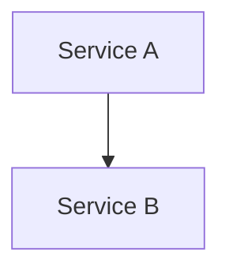

# Week 4 – RDS Database Deployment

## 📜 Task Description
_Refer to bootcamp task list for detailed instructions._

## 🛠 Step-by-Step Implementation
1. Step 1 – Open AWS Console
2. Step 2 – Navigate to the relevant service
3. Step 3 – Create/Configure resource per instructions
4. Step 4 – Verify connectivity
5. Step 5 – Clean up resources after verification

### 🗺 Architecture Diagram

## 🧠 Mental Model / Analogy
Think of this setup like building a city: the VPC is the city boundary, subnets are the neighborhoods, and services are the houses and businesses inside.

### 🧠 My Learning Experience
This week was both challenging and rewarding. I had to troubleshoot unexpected errors while configuring resources.
One key takeaway was that AWS services often require precise security group and IAM configurations to work together.
I also realized that breaking problems into smaller steps helped me debug faster.

### 📋 Deliverables Checklist
- [ ] Screenshot – AWS Console main resource
- [ ] Screenshot – Security group settings
- [ ] Screenshot – Successful connection/output

## 📸 Screenshots

