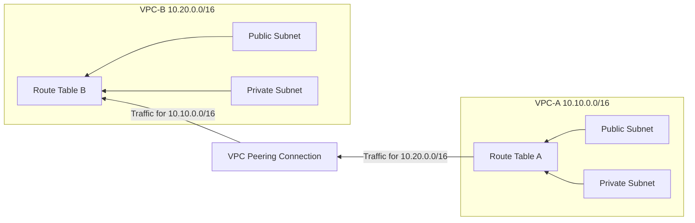

## Week 4: Multi-VPC Network Architecture 

**🎯 Objective: Create interconnected VPC architecture with proper routing** 

**🏗️ Architecture**:

**🔧 Technologies**: VPC, Subnets, VPC Peering, Route Tables, Security Groups

#### The two VPCs and their CIDR blocks: VPC-CSN-A and VPC-CSN-B 

#### VPC-CSN-A        10.10.0.0/16 

#### VPC-CSN-A        Subnets 

#### VPC-CSN-B        10.20.0.0/16 

#### VPC-CSN-B    - Subnets 

#### The VPC-A-to-B-Peering, peering connection in Active status 

#### The route tables for the VPC-CSN-A with routes pointing to the VPC-CSN-B CIDR block through the peering connection. 

#### The route tables for the VPC-CSN-B with routes pointing to the VPC-CSN-A CIDR block through the peering connection. 

#### 📊 Key Learnings: 

  * Network troubleshooting methodology 
  * Symmetric routing importance 

VPC design patterns 

 
