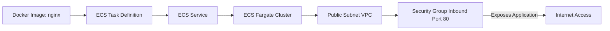

## Week 5: Container Orchestration 

**🎯 Objective: Deploy containerized applications using ECS Fargate** 

### 🏗️ Architecture: 

### 🔧 Technologies: ECS, Fargate, Docker, Application Load Balancer 

 #### ECS Cluster and Running Service (Initial Cluster View) 

#### Task Definition with grafana/grafana Image and Port 3000 

#### Security Group for Grafana access Port 3000 

#### ECS Cluster and Running Service 

#### Grafana Login Page 

#### Grafana Welcome Page (successful logging) 

#### 📊 Key Learnings: 

  * Serverless container orchestration
  * Service discovery patterns
  * Container security best practices 

 
