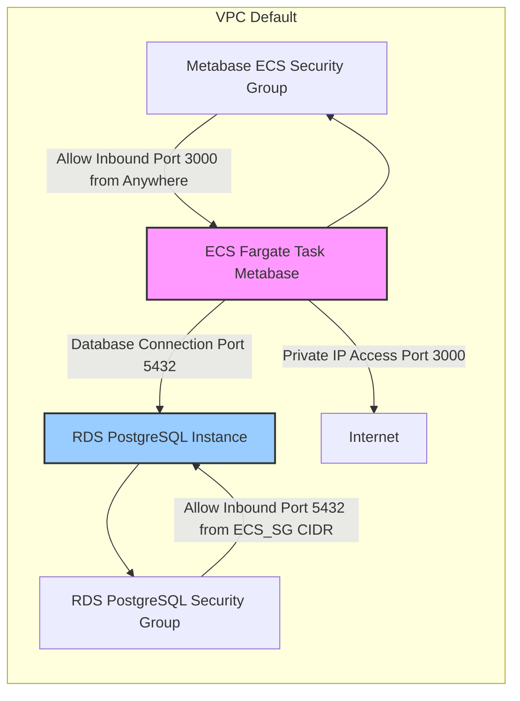

# Week 6: Database Integration & Data Management 

### 🎯 Objective: Deploy Metabase on Amazon ECS using Fargate and connect it to a PostgreSQL database hosted on Amazon RDS. This involves configuring database connectivity via environment variables and ensuring proper security group rules for communication. 

### 🏗️ Architecture: 

### 🔧 Technologies: RDS PostgreSQL, ECS, Parameter Store, VPC Endpoints 

#### Meta RDS PostgreSQL Instance Details 

#### Security Group Rules Allowing Traffic from ECS to RDS 

#### Metabase-Fargate-Cluster ECS Cluster and Running Service (Initial Cluster View) 

#### ECS Task Definition with metabase/metabase Image and Environment Variables 

#### Security Group Rules Allowing Traffic to ECS (Port 3000) 

#### ECS Cluster and Running Service MetaBase

#### Metabase Setup Screen Confirming Successful Connection to the Database 

### 📊 Key Learnings: 
  * Database security and encryption
  * Connection pooling optimization 

 
