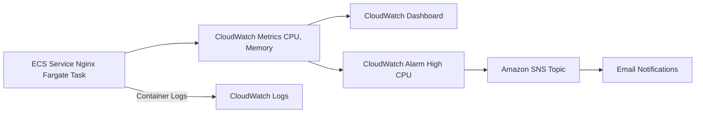

# Week 7: Observability & Performance Monitoring 

**🎯 Objective: Implement comprehensive monitoring with CloudWatch** 

**🏗️ Architecture:** 

**🔧 Technologies**: CloudWatch, CloudWatch Dashboards, CloudWatch Alarms, CloudWatch Logs, ECS Nginx

#### ECS cluster and running service – Nginx container 

#### CloudWatch dashboard displaying the CPU and Memory utilization widgets for your Nginx service. 

#### Load Nginx page... 

#### CloudWatch Dashboard with metrics changed after loading Nginx page 

### 📊 Key Learnings: 
  * Proactive monitoring strategies
  * Cost-optimized scaling patterns 
