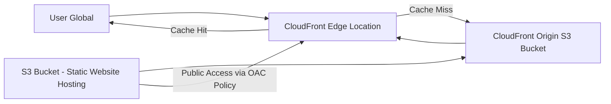

# Week 8: Global Content Delivery 

**🎯 Objective: Deploy globally distributed static website with cloud front** 

**🏗️ Architecture:** 

#### Static Website Hosting for my chapy-personal-portfolio 

#### Bucket Policy 

#### CloudFront distribution setting 

#### CloudFront demo 

😰 *Challenge Overcome:* Encountered caching issues where updates weren't reflecting immediately. Learned about CloudFront invalidation strategies and implemented cache-control headers properly to balance performance and content freshness. 

### 📊 Key Learnings: 
  * content delivery network (CDN)
  * Global edge computing patterns
  * Cache optimization strategies 
