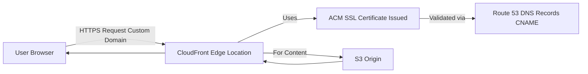

# Week 9: DNS Management & SSL Automation 

**🎯 Objective: Implement automated certificate management with custom domain** 

**🏗️ Architecture:** 

 #### Domain Registration and Route 53 - Giving My Site a Home 
 

_'This was my first time registering a domain and connecting it to AWS Route 53. It felt like a fundamental step in making my website truly mine. Porkbun was a straightforward way to get a domain without hidden fees, and then updating the nameservers in Route 53 was the critical link. It's like telling the internet, "Hey, for this domain, come to AWS for directions!" This step really solidified my understanding of how DNS works in the cloud.'_ 

 #### SSL Certificate - The Padlock of Trust 

Securing my website with HTTPS was a non-negotiable. Users expect it, and search engines prefer it. AWS Certificate Manager (ACM) made getting a free SSL certificate incredibly easy. The DNS validation method in Route 53 was a neat trick – it automatically added the necessary CNAME records, proving I owned the domain without me having to manually mess with DNS. This step was crucial for building trust and ensuring encrypted communication for my website visitors. 

#### CloudFront Integration and HTTPS - The Final Polish 

This was the grand finale! Attaching the newly issued SSL certificate to my CloudFront distribution was the last piece of the puzzle. It meant that all traffic to my custom domain would now be served securely over HTTPS, leveraging CloudFront's global network. It was incredibly satisfying to type my custom domain into the browser and see the website load with the secure padlock, knowing that all the pieces of my AWS architecture were now working together seamlessly. 

#### On Chrome browser 

#### On Microsoft Edge 

 

 
